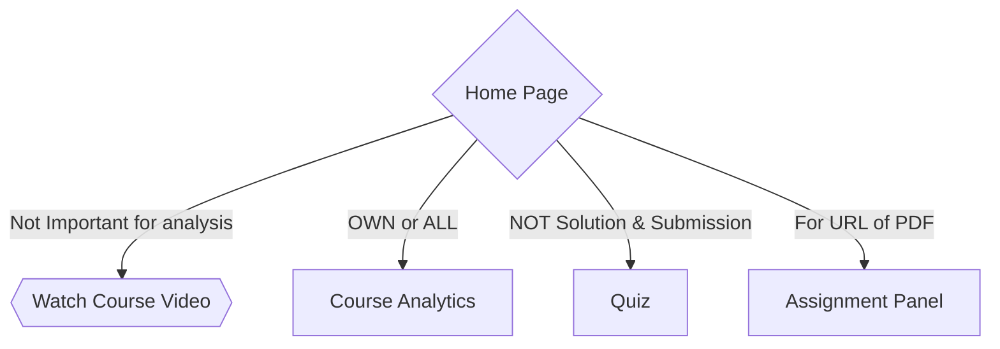

# HAR FILES ANALYSIS

## What are HAR files?

▶️ **HAR** (HTTP Archive) is a file format used to store HTTP interaction data between a web browser and a web server. The data typically includes information such as HTTP requests, responses, headers, timings, and more.

▶️ **HAR** files are commonly used for debugging and analyzing web performance issues, as they provide detailed insights into the various network requests made by a webpage and their corresponding timings.

▶️ They can also be used for security auditing and testing, as they can reveal potential security vulnerabilities and sensitive information leakage.

## Conclusion 1

1.  All the URLs have `'https://api.pwskills.com/v1/'`. It is like root/base URL for the api requests.

    ```json
    // https://api.pwskills.com/v1?all=true

    {
      "env": "production",
      "instance": "0.8391243622921039",
      "version": "1.83.4",
      "all": {
        "totalmem": 32.823218176,
        "freemem": 29.265063936
      }
    }
    ```

2.  All the above URLs are `authorized`. These URL's response are take using `cURL` command by providing the header `Authorization`.  
    _Authorization requires a Bearer._

    ```json
    { "error": "Unauthorized" }
    ```

3.  [URL](https://api.pwskills.com/v1/course/63a2eb428899436daf7eb489?withAllCourseMetas=true&ignoreInActive=true) is public to use, it doesn't require any authorization for GET request.  
    This gives all the data related to the specified course. _Courses are identify using its Course ID_.

> Data Science Masters Course ID: `63a2eb428899436daf7eb489`

## How to get the quizzes data.

1. You can get it by using `cURL` command and by providing `Authorization` request header.
2. Try to create a session using `requests` library and scrape the data.
3. Web scrapping using selenium.

### Problems for fetching the data <small><sub>respectively</sub></small>

1. The `Authorization` IDs are changes for every request.
2. If use `requests` library for Session State you have to login with `Google`. Means you cannot provide **payload** of _email and password_.
3. Same goes with `Selenium` method. It also require the Google SignIn part to get into the website.

> Also this applies to all the _Authorized URLs_.

# URL Analysis

## Web Surfline



## URL Assembly

1. Home Page
   - Require proper Sign In from browser.
   - https://learn.pwskills.com/lesson/Working-with-MongoDB/63ef8452ff4766650ddc4e5d/course/Data-Science-masters/63a2eb428899436daf7eb489
   - https://learn.pwskills.com/course/Data-Science-masters/63a2eb428899436daf7eb489
2. Videos
   1. In order to get the video resources.
      - https://api.pwskills.com/v1/learn/lesson/course/63a2eb428899436daf7eb489/6404dd8f182c676b084c3bad
   2. Make URL for all the videos and get the video resources and provide them in Web-App.
3. Analytics
   1. Using `requests` module you can get **all** analytics.
      - https://learn.pwskills.com/course-analytics/Data-Science-masters/63a2eb428899436daf7eb489
   2. Get your own analytics using `cURL` command.
      - https://api.pwskills.com/v1/learn/analytics/progress/course/63a2eb428899436daf7eb489
   3. Get you submission data using `cURL` command. Also, Submission data is fetches by the Home page too.
      - https://api.pwskills.com/v1/learn/submission/63a2eb428899436daf7eb489
4. Quiz
   1. Get a particular Quiz data. If quiz is submitted, marks details includes in the response data.
      - https://api.pwskills.com/v1/learn/lesson/course/63a2eb428899436daf7eb489/63fa2330182c6727c14b9189
5. Assignment
   1. Get a particular Assignment data. If assignment is submitted, marks and submitted url details includes in the response data.
      - https://api.pwskills.com/v1/learn/lesson/course/63a2eb428899436daf7eb489/63fa1682182c67aa884b90ef
