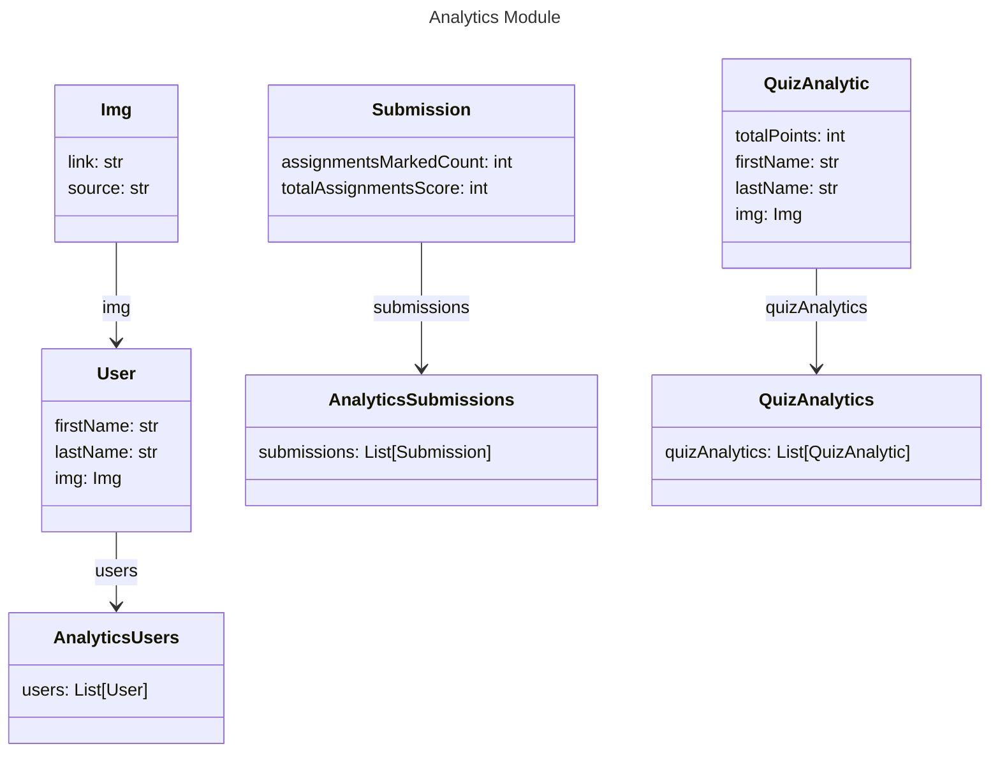
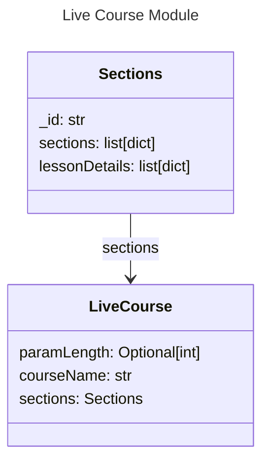
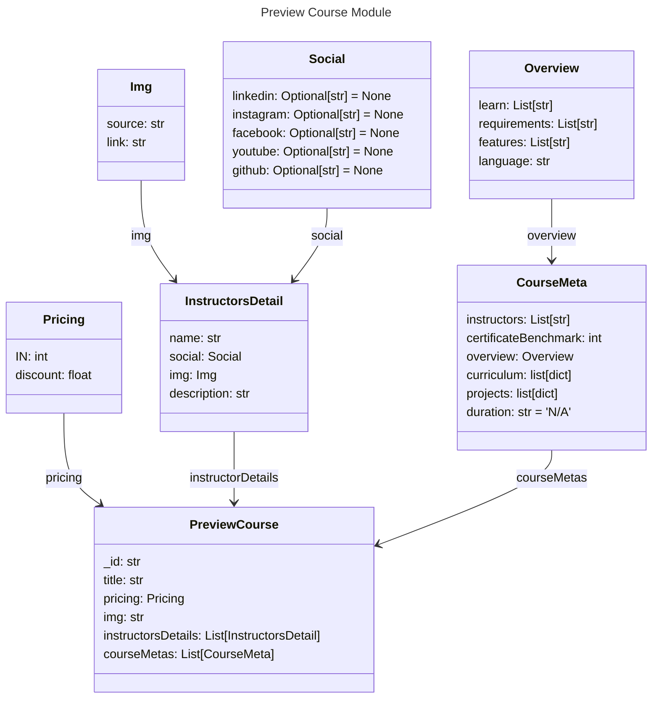

# Diagrams

```mermaid
---
title: Analytics Module
---

classDiagram
    class Img {
        link: str
        source: str
    }

    class User {
        firstName: str
        lastName: str
        img: Img
    }

    class Submission {
        assignmentsMarkedCount: int
        totalAssignmentsScore: int
    }

    class QuizAnalytic {
        totalPoints: int
        firstName: str
        lastName: str
        img: Img
    }

    class AnalyticsUsers {
        users: List[User]
    }

    class AnalyticsSubmissions {
        submissions: List[Submission]
    }

    class QuizAnalytics {
        quizAnalytics: List[QuizAnalytic]
    }

    QuizAnalytic --> QuizAnalytics : quizAnalytics
    Submission --> AnalyticsSubmissions : submissions
    User --> AnalyticsUsers : users
    Img --> User : img
```

---

```mermaid
---
title: Live Course Module
---

classDiagram
    class Sections {
        _id: str
        sections: list[dict]
        lessonDetails: list[dict]
    }

    class LiveCourse {
        paramLength: Optional[int]
        courseName: str
        sections: Sections
    }

    Sections --> LiveCourse : sections
```

---

```mermaid
---
title: Preview Course Module
---

classDiagram
    class Pricing {
        IN: int
        discount: float
    }

    class Social {
        linkedin: Optional[str] = None
        instagram: Optional[str] = None
        facebook: Optional[str] = None
        youtube: Optional[str] = None
        github: Optional[str] = None
    }

    class Img {
        source: str
        link: str
    }

    class InstructorsDetail {
        name: str
        social: Social
        img: Img
        description: str
    }

    class Overview {
        learn: List[str]
        requirements: List[str]
        features: List[str]
        language: str
    }

    class CourseMeta {
        instructors: List[str]
        certificateBenchmark: int
        overview: Overview
        curriculum: list[dict]
        projects: list[dict]
        duration: str = 'N/A'
    }

    class PreviewCourse {
        _id: str
        title: str
        pricing: Pricing
        img: str
        instructorsDetails: List[InstructorsDetail]
        courseMetas: List[CourseMeta]
    }

    Overview --> CourseMeta : overview
    Pricing --> PreviewCourse : pricing
    InstructorsDetail --> PreviewCourse : instructorDetails
    CourseMeta --> PreviewCourse : courseMetas
    Img --> InstructorsDetail : img
    Social --> InstructorsDetail : social
```
